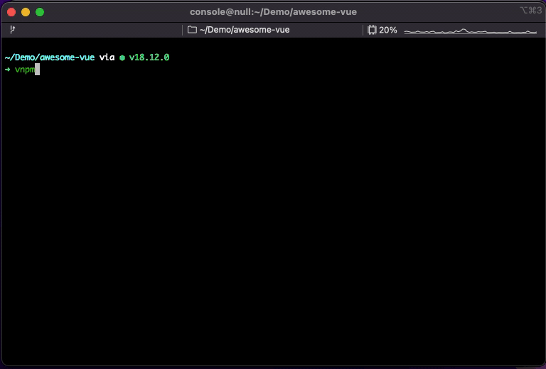

<p align="center">
  <br>
	<br>
  <a href="https://github.com/hunghg255/pkg-search">
    
  </a>
  <br>
	<br>
</p>
<p align='center'>
Interactive CLI for npm - search and install JavaScript package. Powered by <a href="https://github.com/vue-terminal/vue-termui">vue-termui</a>.
</p>


## 📺 Preview

<p align='center'>
 
</p>

## 🔥 Features

- 🔍 **Powerful Search:** Search all the packages from npm and Yarn.
- 👼 **User Friendly:** Search and install packages with a simple keystroke.
- 📦 **Powerful Installer:** Support npm · yarn · pnpm · bun.

## 📦 Run

```sh
npx pkg-search
```
