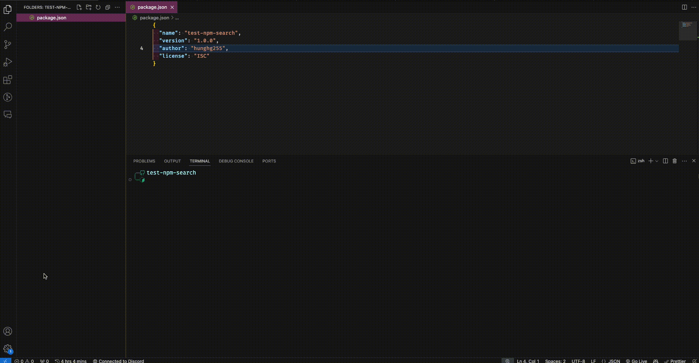

<p align="center">
<a href="https://www.npmjs.com/package/pkg-search" target="_blank" rel="noopener noreferrer">
</a>
</p>

<p align="center">
  Search Install Packages from NPM and Yarn on Terminal
</p>

<p align="center">
  <a href="https://www.npmjs.com/package/pkg-search" target="_blank" rel="noopener noreferrer"></a>
  <a href="https://www.npmjs.com/package/pkg-search" target="_blank" rel="noopener noreferrer"></a>
  <a href="https://bundlephobia.com/result?p=pkg-search" target="_blank" rel="noopener noreferrer"></a>
  <a href="https://github.com/hunghg255/pkg-search/graphs/contributors" target="_blank" rel="noopener noreferrer"></a>
  <a href="https://github.com/hunghg255/pkg-search/blob/main/LICENSE" target="_blank" rel="noopener noreferrer"></a>
</p>


## 📺 Preview

<p align='center'>
 
</p>

## 🔥 Features

- 🔍 **Powerful Search:** Search all the packages from npm and Yarn.
- 👼 **User Friendly:** Search and install packages with a simple keystroke.
- 📦 **Powerful Installer:** Support npm · yarn · pnpm · bun.

## 📦 Run

```sh
npx pkg-search
```
